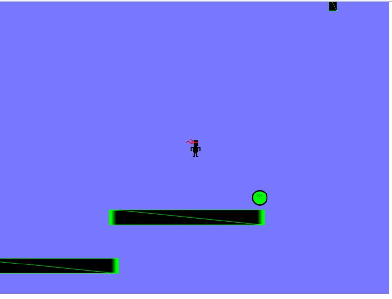

# Platforms, questions and trols
# EN-us
This project is a simple platformer game developed using Phaser 3. It features a player character navigating platforms, collecting coins, and interacting with various elements such as invisible blocks and question mark objects.

## Gameplay Overview

The game includes the following features:

- **Player Character:** A sprite controlled by the player using arrow keys for movement and jumping.
- **Platforms:** Static platforms that the player can stand on and jump between.
- **Invisible Blocks:** Blocks initially invisible but revealed when the player interacts with them.
- **Question Marks:** Objects triggering specific actions or events when collected by the player.
- **Flag:** End goal where the player wins upon reaching it.

## How to Play

To play the game, simply open the `index.html` file in your web browser. The game will start automatically.

## Contributing

Contributions are welcome! If you'd like to enhance the game, feel free to fork this repository, make your changes, and submit a pull request. Please ensure your code adheres to the coding standards and includes relevant documentation.

## License

MIT

## Acknowledgments

Special thanks to artur.

# PT-br
Este projeto é um jogo de plataforma simples desenvolvido em Phaser 3. Ele apresenta um personagem do jogador navegando em plataformas, coletando moedas e interagindo com vários elementos, como blocos invisíveis e objetos de ponto de interrogação.

## Visão geral da jogabilidade

O jogo inclui os seguintes recursos:

- **Personagem do jogador:** Um sprite controlado pelo jogador usando as teclas de seta para movimento e salto.
- **Plataformas:** Plataformas estáticas nas quais o jogador pode ficar de pé e pular.

- **Blocos Invisíveis:** Blocos inicialmente invisíveis, mas revelados quando o jogador interage com eles.
- **Pontos de interrogação:** Objetos que desencadeiam ações ou eventos específicos quando coletados pelo jogador.
- **Bandeira:** Meta final onde o jogador vence ao alcançá-la.

## Como jogar

Para jogar, basta abrir o arquivo `index.html` em seu navegador. O jogo começará automaticamente.

## Contribuindo

Contribuições são bem-vindas! Se você quiser aprimorar o jogo, sinta-se à vontade para fazer um fork deste repositório, fazer suas alterações e enviar uma solicitação pull. Certifique-se de que seu código esteja de acordo com os padrões de codificação e inclua documentação relevante.

## Licença

MIT

## Agradecimentos

Agradecimentos especiais a artur.
